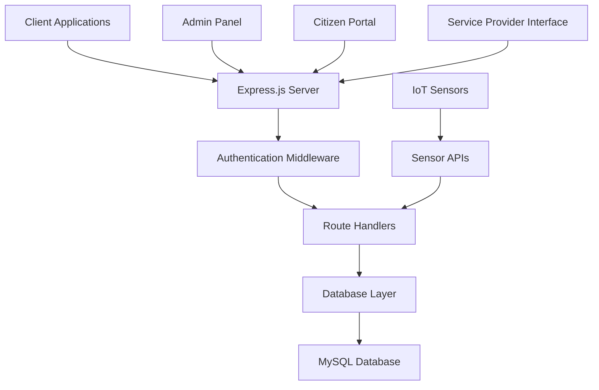

# Smart City Management System - Backend

A comprehensive RESTful API backend for managing smart city infrastructure, citizens, services, and IoT sensors. This system provides a complete solution for digital city governance and management.

## 🏗️ Project Overview

The Smart City Management System is a Node.js/Express.js backend application that manages various aspects of a smart city including:

- **Citizen Management**: Registration, profiles, and authentication
- **Infrastructure**: Buildings, zones, utilities, and public facilities
- **IoT Sensors**: Traffic, air quality, and weather monitoring
- **Transportation**: Public transport, routes, and schedules
- **Utilities**: Water, electricity, and waste management
- **Healthcare**: Doctors, services, and medical facilities
- **Smart Bins**: Waste collection and monitoring
- **Complaint System**: Citizen grievances and issue tracking

## 🛠️ Technology Stack

- **Runtime**: Node.js
- **Framework**: Express.js
- **Database**: MySQL 2
- **Authentication**: JWT (JSON Web Tokens)
- **Password Hashing**: bcrypt
- **Documentation**: Swagger UI
- **Validation**: Joi
- **Environment Management**: dotenv

## 📋 Prerequisites

Before running this project, make sure you have the following installed:

- Node.js (v14 or higher)
- npm or yarn
- MySQL Server (v8.0 or higher)
- Git

## 🚀 Getting Started

### 1. Clone the Repository

```bash
git clone https://github.com/Devanshi-Mahto/smartcity-backend.git
cd smartcity-backend
```

### 2. Install Dependencies

```bash
npm install
```

### 3. Database Setup

1. Create a MySQL database named `smartcity_management_system`
2. Update the database configuration in `db.js`:
   ```javascript
   const db = mysql.createPool({
     host: 'your_host',
     port: 3306,
     user: 'your_username',
     password: 'your_password',
     database: 'smartcity_management_system'
   });
   ```

3. Execute the database schema from `database_Schemas.txt` to create all required tables

### 4. Environment Configuration

Create a `.env` file in the root directory (optional):

```env
PORT=5000
JWT_SECRET=your_jwt_secret_key
DB_HOST=127.0.0.1
DB_PORT=3306
DB_USER=root
DB_PASSWORD=your_password
DB_NAME=smartcity_management_system
SMTP_USER=your_email@gmail.com
SMTP_PASS=your_app_password
```

### 5. Initialize Admin User

Run the admin setup script:

```bash
node addAdmin.js
```

### 6. Start the Server

```bash
npm start
# or for development
node server.js
```

The server will start on `http://localhost:5000`

## 📚 API Documentation

Interactive API documentation is available at:
```
http://localhost:5000/api/docs
```

## 🗂️ Project Structure

```
smartcity-backend/
├── server.js              # Main server file
├── db.js                  # Database connection and configuration
├── package.json           # Dependencies and scripts
├── addAdmin.js            # Admin user setup script
├── database_Schemas.txt   # Complete database schema
├── middleware/
│   ├── auth.js           # JWT authentication middleware
│   └── error.js          # Error handling middleware
└── routes/               # API route handlers
    ├── auth.js           # Authentication (login/register)
    ├── citizens.js       # Citizen management
    ├── complaints.js     # Complaint system
    ├── vehicles.js       # Vehicle management
    ├── utilities.js      # Utility services
    ├── healthcare.js     # Healthcare services
    ├── services.js       # General services
    ├── providers.js      # Service providers
    ├── doctors.js        # Doctor management
    ├── zones.js          # Zone/area management
    ├── houses.js         # Housing management
    ├── infrastructure.js # Infrastructure assets
    ├── sensors.js        # IoT sensor management
    ├── smartBins.js      # Smart waste bins
    ├── transport.js      # Transportation
    ├── routes.js         # Transport routes
    └── ... (additional route files)
```

## 🔐 Authentication & Authorization

The system uses JWT-based authentication with role-based access control:

- **Admin**: Full system access
- **Citizen**: Limited access to personal data and public services
- **Provider**: Access to service-related endpoints

### Authentication Flow

1. **Register**: `POST /api/auth/register`
2. **Login**: `POST /api/auth/login`
3. **Protected Routes**: Include `Authorization: Bearer <token>` header

## 🛣️ API Endpoints Overview

### Core Endpoints

| Module | Base URL | Description |
|--------|----------|-------------|
| Authentication | `/api/auth` | User registration, login |
| Citizens | `/api/citizens` | Citizen management |
| Complaints | `/api/complaints` | Complaint system |
| Vehicles | `/api/vehicles` | Vehicle registration |
| Utilities | `/api/utilities` | Utility services |
| Healthcare | `/api/healthcare` | Medical services |
| Zones | `/api/zones` | Geographic zones |
| Infrastructure | `/api/infrastructure` | City infrastructure |
| Sensors | `/api/sensors` | IoT sensor data |
| Smart Bins | `/api/smart-bins` | Waste management |
| Transport | `/api/transport` | Public transportation |

### Example Requests

**Register a new citizen:**
```bash
POST /api/auth/register
{
  "username": "john.doe",
  "password": "securePassword",
  "role": "citizen",
  "linked_id": 123
}
```

**Get all zones:**
```bash
GET /api/zones
Authorization: Bearer <your_token>
```

## 🏛️ Database Schema

The system uses a comprehensive relational database schema with the following main entities:

- **Zone**: Geographic divisions
- **House**: Residential properties
- **Citizen**: Registered residents
- **Service_Provider**: Service companies
- **Infrastructure**: City assets
- **Sensors**: IoT monitoring devices
- **Vehicles**: Transportation assets
- **Utilities**: Essential services

## 🌐 System Architecture Flow



## 🔧 Key Features

### 1. Citizen Management
- Registration and profile management
- Multi-phone number support
- Address and zone association

### 2. IoT Integration
- Traffic sensor monitoring
- Air quality measurements
- Weather data collection
- Real-time sensor readings

### 3. Smart Infrastructure
- Public lighting management
- Smart waste bin monitoring
- Utility consumption tracking
- Infrastructure asset management

### 4. Transportation System
- Route planning and management
- Public transport scheduling
- Vehicle registration and tracking

### 5. Healthcare Services
- Doctor and hospital management
- Medical service tracking
- Healthcare provider integration

## 🧪 Testing

To run tests (when implemented):

```bash
npm test
```

## 🚀 Deployment

### Production Setup

1. Set up a production MySQL database
2. Configure environment variables
3. Use a process manager like PM2:

```bash
npm install -g pm2
pm2 start server.js --name "smartcity-backend"
```

### Docker Deployment (Optional)

Create a `Dockerfile`:

```dockerfile
FROM node:16-alpine
WORKDIR /app
COPY package*.json ./
RUN npm install --production
COPY . .
EXPOSE 5000
CMD ["node", "server.js"]
```

## 🤝 Contributing

1. Fork the repository
2. Create a feature branch: `git checkout -b feature-name`
3. Commit changes: `git commit -m 'Add feature'`
4. Push to branch: `git push origin feature-name`
5. Submit a pull request

## 📝 License

This project is licensed under the ISC License.

## 🙋‍♂️ Support

For support and questions:
- Create an issue in the GitHub repository
- Contact the development team

---

**Version**: 1.0.0  
**Last Updated**: October 2025